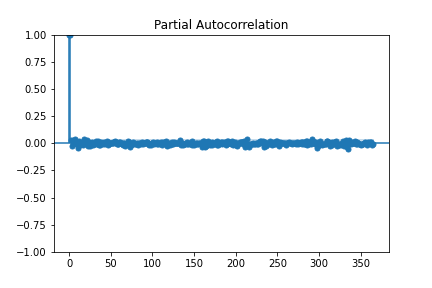
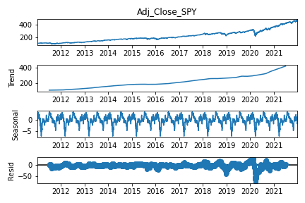
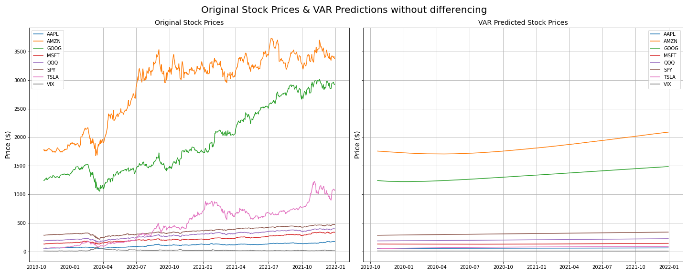
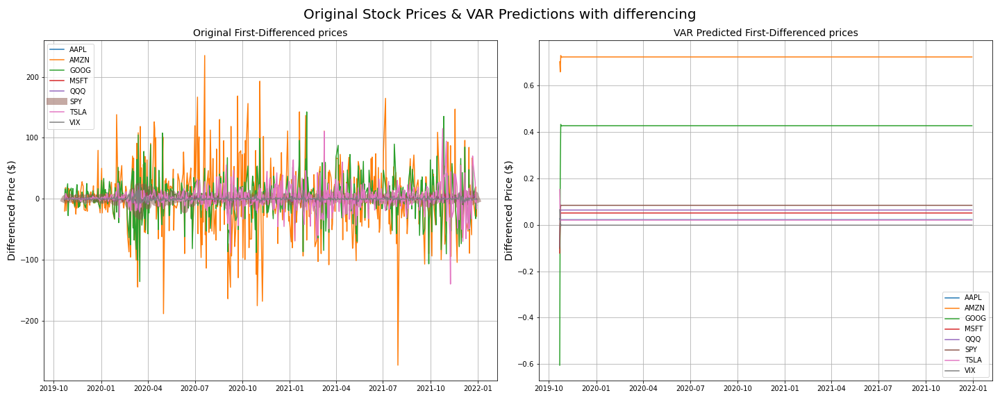
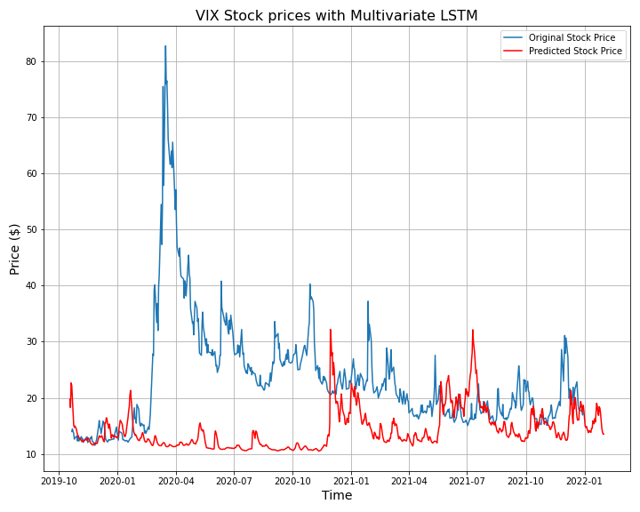
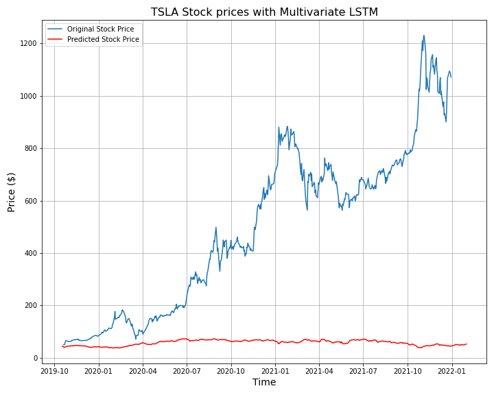
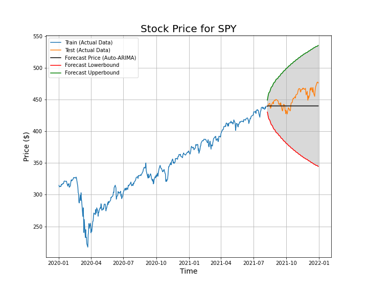
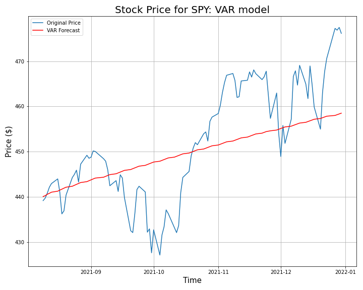
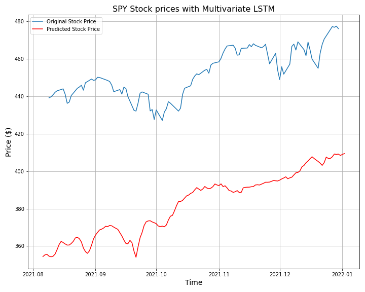

# Predicting the equity price with Time Series Analysis and Machine Learning. 

## Description
In this project, historical trading data of selected equities is collected using Yahoo Finance API, and Time Series Analysis and Machine Learning are performed to predict and forecast the future prices of selected equities. <br>
This project utilizes past 10 years of historical trading data from 2011 to 2021. The outcomes of machine learning and predictions reveal a general trend in the models utilized in the project not being able to pick up rather explosive recent growths in the stock market, yielding quite some diffrerence between the actual price of the equity and the predicted/forecasted price. The author hopes and intends to implement changes in the periods of trading data utilized for modeling and tune the models to navigate whether better prediction outcomes could be achieved. 

## Problem Statement

The goal in this project is to collect historical stock trading data using an API, and perform Time Series Analysis and Machine Learning with Autoregressive Integrated Moving Average (ARIMA) model, Vector Autoregressive (VAR) model, and Long Short-Term Memory (LSTM) model to predict and forecast future stock price. 

The success of outcome will be measured based on how accurately the models predict equity price of interest and compared to the actual prices of the equities using MSE and RMSE. 

## Guide to Files

|File Name|Description|
|:---|:---|
|[1. Data_Collection.ipynb](https://github.com/mh0805/Stock-price-prediction-and-forecast-with-Time-series-analysis-and-Machine-Learning)|Data collection notebook|
|[2. EDA.ipynb](https://github.com/mh0805/Stock-price-prediction-and-forecast-with-Time-series-analysis-and-Machine-Learning/blob/main/2.%20EDA.ipynb)|EDA notebook|
|[3. Data Pre-processing & Modeling.ipynb](https://github.com/mh0805/Stock-price-prediction-and-forecast-with-Time-series-analysis-and-Machine-Learning/blob/main/3.%20Data%20Pre-processing%20%26%20Modeling.ipynb)|Data Pre-processing and Modeling notebook|
|[README.md](https://github.com/mh0805/Stock-price-prediction-and-forecast-with-Time-series-analysis-and-Machine-Learning/blob/main/README.md)|Readme file for the project|
|[data](https://github.com/mh0805/Stock-price-prediction-and-forecast-with-Time-series-analysis-and-Machine-Learning/tree/main/data)|Historical trading data of stocks||
|[images](https://github.com/mh0805/Stock-price-prediction-and-forecast-with-Time-series-analysis-and-Machine-Learning/tree/main/images)|Images/Graphs/Plots obtained from the project|
|[Forecast with Prophet using Streamlit.py](https://github.com/mh0805/Stock-price-prediction-and-forecast-with-Time-series-analysis-and-Machine-Learning/blob/main/Forecast%20with%20Prophet%20using%20Streamlit.py)|Python Executable Script file for Streamlit app, using Prophet for stock price prediction. <br>This is a part of **Next Steps**.|
|[Presentation Slides](https://github.com/mh0805/Stock-price-prediction-and-forecast-with-Time-series-analysis-and-Machine-Learning/blob/main/Presentation%20Slides.pdf)|Powerpoint Presentation Slides in PDF format.|

## Libraries & Packages
In order to run this project properly, the following libraries and packages need to be installed:

|Library/Packages   | Command using `pip`|
|:---|:---|
||```pip install pandas```|
||```pip install numpy```|
||```pip install scikit-learn```|
||```pip install tensorflow```|
||```pip install keras```|
|Seaborn|```pip install seaborn```|
|Time|```pip install time```|
|Datetime|```pip install datetime```|
|Matplotlib|```pip install matplotlib```|
|Yahoo Finance API|```pip install yfinance```|
|Technical Analysis Library|```pip install ta```|
|Statsmodels|```pip install statsmodels```|
|pmdarima|```pip install pmdarima```|
|warnings|```pip install pytest-warnings```|

## Data Collection

Historical trading data of equities of interest was obtained using Yahoo Finance API. <br>
The data available from Yahoo Finance comprises of Open, High, Low, Close, Adjusted Close, and Volume of given equity. <br>
The API was set to collect daily trading data **from 01/01/2011 to 12/31/2021**, inclusive of all **trading days** in the past 10 years for pre-defined stock symbols: SPY, QQQ, AAPL, AMZN, GOOG, MSFT, TSLA, and VIX. <br>

|Stock Ticker|Name|
|:---|:---|
|SPY|SPDR S&P 500 ETF Trust, Standard and Poor 500|
|QQQ|Invesco QQQ Trust Series 1, Nasdaq ETF|
|AAPL|Apple, Inc.|
|AMZN|Amazon, Inc.|
|GOOG|Alphabet, Inc. (Google)|
|MSFT|Microsoft, Inc.|
|TSLA|Tesla, Inc.|
|VIX|Chicago Board Options Exchange's CBOE Volatility Index|


Obtained data is saved to a CSV file to be accessed in a separate EDA notebook. The data collection notebook also introduces another way of obtaining the same data without using an API. 

All the code for data collection can be viewed here:

[Link to Data Collection Notebook](https://github.com/mh0805/Stock-price-prediction-and-forecast-with-Time-series-analysis-and-Machine-Learning/blob/main/1.%20Data_Collection.ipynb)

## Data Dictionary

|Term|Description|
|:-------|:-------|
|**Open**|Opening price of the equity for a given period|
|**High**|Highest price of the equity for a given period|
|**Low**|Lowest price of the equity for a given period|
|**Close**|Closing price of the equity for a given period|
|**Adj Close**|Adjusted closing price of the equity for a given period, accounting for any corporate actions, such as stock splits, dividends, and rights offerings. |
|**VWAP**|Volume-Weighted Average Price of the equity, calculated by taking the total dollar value of trading in the security and dividing it by the volume of trades for a given period.|
|**Daily_pct_change**|Daily percentage change of the equity, also referred often as daily returns. |
|**log_Adj_Close**|Log-transformed adjusted closing price of the equity for a given period, utilized to better compare the performance of the stocks. Log transformation reduces/removes the skewness of the original data.|
|**log_VWAP**|Log-transformed VWAP of the equity for a given period, utilized to better compare the performance of the stocks. Log transformation reduces/removes the skewness of the original data.|

## Exploratory Data Analysis
[Link to EDA Notebook](https://github.com/mh0805/Stock-price-prediction-and-forecast-with-Time-series-analysis-and-Machine-Learning/blob/main/2.%20EDA.ipynb)

#### TL;DR
Each stock price was compared using adjusted closing price and log-scaled adjusted closing price for the performance. Volume, VWAP, and daily percentage change were navigated as well and histogram and KDE plots were analyzed. Chosen stock tickers for this project show high correlation.

#### Full EDA
The initial data from Yahoo Finance comprises of Open, High, Low, Close, Adj Close, and Volume. The data was clean without any missing values. Prior to begin with any EDA, the index was set to datatime index using pandas. Here is an example:
```python
SPY['Date'] = pd.to_datetime(SPY['Date'], format='%Y-%m-%d')
```
Once the indexes were reformatted, VWAP was calculated using technical analysis library `ta`. <br>

An attention was made here that **VIX** (Chicago Board Options Exchange (CBOE) Volatility Index) does not have any traded volume, hence is not considered in any future VWAP related calculations. 

Each equity was plotted with 50 and 200 moving average, then plotted together. <br>
Note: 50 and 200 daily moving averages are often referred to measure the performance of the stock and particularly for Golden Cross and Death Cross. 

[Read more about it here](https://www.investopedia.com/ask/answers/121114/what-difference-between-golden-cross-and-death-cross-pattern.asp)


Here, the chart is plotted with the actual dollar value of the stocks. While it is easy to compare the monetary value of each ticker's price per share value here, it would be better to compare the performances using log-scaled price charts.

Then, log adjusted prices of each equity were plotted to compare performance. 


Here, an observation was made that all stocks except the volatility index (VIX) made progressive growth over time, with particularly explosive growth noted in Tesla (TSLA) since late 2019 and onward. 

Daily trading volume and percentage changes were compared in the same fashion, as well as log-transformed data of each trading volume and percentage change as well. A similarity in the plots was observed, though it was difficult to locate an exact time period of the peaks in the plot due to the dataset being 10 years of **daily** trading data. From a log daily VWAP percentage change plot, an interesting phenomenon was observed. There were distinguishable **downward peaks**, suggesting that it would be worthwhile to investigate historical economical events preceeding the sudden spikes as a spin-off to this project.


Histograms and KDE plots were plotted for daily VWAP percentage changes and each histogram showed farely symmetrical distribution, showing both positive and negative daily returns. Here is an example:


It is also worthwhile to note that the equities chosen for this projects are some main leading companies in the market, holding heavy weights particularly in Standard and Poor 500 and Nasdaq. 

[Read more about S&P 500 holdings here](https://www.slickcharts.com/sp500) <br>
[Read more about Nasdaq holdings here](https://finance.yahoo.com/quote/NASDX/holdings/)

Hence, an attention was made to investigate the correlation between each equities. Correlation matrices were obtained for adjusted closing price, log adjusted closing price, daily percentage changes, and daily VWAP percentage changes of the stocks. As expected, they exhibited very high correlation. A score closer to 1 indicates high correlation and clower to 0 represents low correlation. Here is a correlation matrix for the adjusted closing price:


Note: VIX is a measure of market volatility. While not a direct inverse of market performance, **VIX tends to move in the opposite direction of the general market trend** as strong bull market is often less volatile compared to bear market. 

## Data Pre-processing & Modeling
[Link to Data pre-processing and Modeling Notebook](https://github.com/mh0805/Stock-price-prediction-and-forecast-with-Time-series-analysis-and-Machine-Learning/blob/main/3.%20Data%20Pre-processing%20%26%20Modeling.ipynb)

Prior to the modeling, a decision was made to drop feature-engineered columns and proceed with only adjusted closing price, volume, VWAP, and daily percentage change (return) of each stocks. Resulting data was cleaned to make sure there was no null values in the dataframe. 

Data was splitted 80:20 for train set and test set. Here, train set includes 8 years of trading data (2011-2019) and test set includes 2 years of trading data (2020-2021). 

Time-Series analysis of the data was performed prior to modeling. The following tests/plots were evaluated:
1. Granger-Causality Test: This test determines whether a time-series data is useful for forecasting another. Knowing the value of time series A at a certain lag is useful for predicting the value of time series B at a later time period. This test proides **F-test stat with a corresponding p-value**, which we can determinde wheter or not to reject the null hypothesis and conclude that we have sufficient evidence to say that the **time series A Granger-causes time series B**. 
There are an average of 253 trading days in a year. Here is an example:

```python
grangercausalitytests(df[['Adj_Close_SPY', 'Adj_Close_QQQ']], maxlag=[253])
```


**Summary**: From the results of Granger-Causality test, we can conclude that knowing the price of SPY is useful for predicting the future prices of stocks: AAPL, AMZN, GOOG, MSFT, QQQ, TSLA, VIX. This also goes in line with the correlation scores shown in the matrix earlier. While VIX showed low score in the correlation, it is due to VIX being the index of volatility and VIX tends to go opposite direction of the general market trend.

2. ACF & PACF Plots: Autocorrelation and Partial Autocorrelation plots. These plots provide valuable information to determine the order of Autoregressive (AR) and/or Moving Average(MA) componetns of ARMA model. 

Here is an example. Lag was set to 365 to investigate for a calendar year:
```python
plot_acf(df['Adj_Close_SPY'], lags=365), plot_pacf(df['Adj_Close_SPY'], lags=365)
```



**Summary**: Based on ACF & PACF plots obtained, adjusted closing prices of stocks AAPL, AMZN, GOOG, MSFT, QQQ, SPY, and TSLA are shown to be non-stationary.
VIX seems it needs more investigation into the data. Seasonal Decomposition and ADFuller test will follow.

3. Seasonal Decomposition: In time-series data, **seasonality** describes when a time series is affected by factors that take on a **fixed and known frequency**. Seasonality does not have to explicitly refer to seasons of the year, but it would mostly be tied to some meaning on the calendar. By default, the decomposition will **assume a linear trend**. If the trend is an exponential trend, then model should be multiplicative, but this will fail with values that are <= 0. <br>

Here is an example. Period was set to 253 to investigate for a trading year.
```python
# Defining a function that takes a variable of stock name to obtain seasonal decomposition. 
def get_seasonal_decompose(ticker):
    # Save the plot
    plt.savefig(f'./images/seasonal_decomposition_{ticker}.png')
    
    return seasonal_decompose(df[f'Adj_Close_{ticker}'], period=253).plot();
```
```python
get_seasonal_decompose('SPY')
```


**Summary**: Seasonality was investigated using seasonal_decompose from statsmodels. From the obtained plots, there was yearly seasonality obtained from each tickers.

4. Augmented Dickey-Fuller Test: ADFuller test is used to test for a unit root in a univariate process in the presence of serial correlation. It is a hypothesis test taht tests for **stationarity**. An assumption is made that the data are **not stationary**. With enough evidence, we may accept that the data are stationary. Test returns adf (test stat.), p-value, usedlag, nobs, critical values (dict), icbest, and resstore. <br> If test statistic (adf) < critical values (dict), we can reject the null hypothesis (not stationary) at that level of significance. Also, p-value is compared to $\alpha$ value of 0.05. If $p$-value > $\alpha$, we cannot accept that the given series is stationary, hence cannot reject the null hypothesis. 

5. Differencing Data for stationarity: The result from ADFuller test was observed that the time-series data was not stationary as shown below:


Hence, the data was differenced first-order and the null values were dropped.
```python 
df_for_diff = df_for_diff.diff().dropna()
```
Here is the result after differentiation:


**Summary**: As seen in the above dataframe, all stocks show extremely high  𝑝 -value, suggesting that:
- We cannot reject the null hypothesis and the data (Stock Prices) are non-stationary.; We would need an integraded model for forecasting. VIX shows extremely low  𝑝 -value of 0.000173. We can reject the null hypothesis and accept the alternative hypothesis at 5% significance ( 𝛼  = 0.05) that VIX is stationary. Again, there is no traded volume on VIX in the dataset obtained from Yahoo Finance. Hence, there is no VWAP calculated for VIX.
- Insight on VIX: VIX is Chicago Board Options Exchange Volatility Index. While it is not essentialy an inverse of the market performance, it often shows the inverse relationship with the general market performance. VIX goes down when the market performs well, indicating the market is stable. VIX goes up when the market is performing poorly and there is increased volatility.

### Modeling

In the modeling, **ARIMA** model was first visited. ARIMA model provides the future trend based on the provided historical time-series data. In order to find the best performing model, AR(p), I(d), MA(q) values are differentiated and fitted, whose process is usually done manually. Here, the process was automated using **Auto-ARIMA**. With ARIMA, the expectation is that the correct model would yield the highest log-likelihood and require the lowest AIC. 

|Stock|Model|Note on the result|
|:----|:----|:---|
|AAPL|SARIMAX(0,1,0)|Exponential growth above the forecast upper boundary noted. No AR or MA component.|
|AMZN|SARIMAX(3,1,2)|Exponential growth above the foreaset upper boundary noted.|
|GOOG|SARIMAX(2,1,2)|Price hovering around the forecast price range. Exponential growth noted after mid 2020.|
|MSFT|SARIMAX(2,1,2)|Price movement with quite a volatility. Exponential growth noted as well afer mid 2020.|
|QQQ|SARIMAX(4,1,4)|Prive movement with quite a volatility both above and below forecast price range. Exponential growth noted after mid 2020.|
|SPY|SARIMAX(1,0,1)|Prive movement with quite a volatility both above and below forecast price range. Exponential growth noted after mid 2020.|
|TSLA|SARIMAX(0,1,0)|Exponential growth above the forecast upper boundary since late 2019. No AR or MA component. |
|VIX|SARIMAX(3,0,2)|The only model that has most price covered in the forecast price range. Hugh spikes in 2020-2021 can be explained by the general market tumult due to COVID-19 pandemic related market shifts and policy changes.|

An interesting observation was made here that **APPL and TSLA did not have the AutoRegressive (AR) component**, suggesting that the previous trading day's price does not affect today's price. Also, these two names did not have the Moving Average component either. 

QQQ (Nasdaq) showed the highest AR component of 4, indicating the price from 4 prior trading days affect today's price. 

Next, Vector AutoRegression (VAR) model was visited with the original data and first-order differentiated data. VAR class assumes that the passed time series are stationary. VAR model was trained on the train data set (8 years, 2011-2019) and tested on the test set (2 years, 2020-2021).



As shown in the above plots juxtaposed, it is clear that the predictions made with VAR model has quite poor performance. Moreover, the prediction also does not seem to pick the ups and downs in the price movement trend either. With a disappointment due to unexpectedly poor results, the model was revisited with first-order differenced data. As confirmed in the ADFuller test, first-order differnced data was shown to be stationary. 



Here in the original first-order differenced stock prices, an observation was made that there are a few extreme spikes in the data, but overall, the prices converge around the mean of zero here, showing stationarity. 

Unfortunately, the VAR model did not return satisfactory results for first-differenced prices for the stocks either.

Moving on, Long Short-Term Memory (LSTM) model was utilized for prediction. Data was used in the same fashion, 80:20 split, 8 years (2011-2019) for train set and 2 years (2020-2021) for test set. Data was scaled using `MinMaxScaler()` to a scale of 0 to 1, and the data was fed through sequential model with stacked layers of LSTM, Dropout, and Dense layer with early stopping on board to prevent over-training. 

Train and Test Loss functions in the mean squared error metric were monitored. Each stocks showed testing loss convergence around the mean of training loss within 6-15 epochs, with an exception of VIX around 20-35. 

Each individual stock price and predicted price were plotted and sadly, VIX was the only name that showed the predicted price similar to the original price, while all other ticker names showed results that are far off. Here are two extreme examples:




#### Models with shorter time period
As shown in the above results, the models (Auto-ARIMA, VAR, and LSTM) returned forecast/prediction that are rather underforming. The original expectation was that the more data trained, the more accurate prediction would be yielded from the models. This does not seem to be the case with the models here. It seems that due to recent explosive growth in the stock market compared to past many years, the models trained on the old historical data are not picking up/catching up with the recent trend in the price changes. Hence, each model was revisited with shorter amount of time period provided for the training. In this section, S&P 500 ETF, **SPY** is examined with data from 2020 to 2021. 

**Auto-ARIMA** model:


Although the model was not able to accurately predict the price again, this time it was able to predict produce an outcome that has the upper and lower boundaries of forecast price comprising of the actual price in the test set. While the forecast boundaries from confidence interval may be far too wide to make an investment decision based on this model, it maybe a worthwhile to consider for option premium sellers to relatively safely consider some strategies. 

**VAR** model:


This model was not able to predict the price accurately either. Moreover, the outcome seems rather linear for the given time period (test set: late 2021). 

**LSTM** model:


LSTM model produced an outcome that is up-trending in a similar fashion, but far apart from the actual observed stock price. 

## Results and Next Steps

The initial assumption prior to proceeding with modeling was that the more historical data provided for the modeling, the more accurate the price forecast/prediction would be. However, the results invalidated the initial assumption. Upon observation of forecast/prediction outcomes in the modeling section, a decision was made to proceed with one ticker symbol, **SPY**, with shorter time period for the models. 

As result: 
- Auto-ARIMA model was able to predict the stock price forecast boundaries including the actual stock price in the test set.
- VAR model was not able to accurately predict the price of the equity nor the trend.
- LSTM model seems to have predicted the trend of the equity price, but not an accurate prediction of the price. 

Below are some error metrics for VAR and LSTM models as they deviated far more from the actual price compared to Auto-ARIMA model:
- VAR model, MSE:  94.55513030271806
- VAR model, RMSE:  9.72394623096602
- LSTM model, MSE:  4985.517976039366
- LSTM model, RMSE:  70.60820048719117

MSE and RMSE of the above models reflect quite large deviation from the stock price, considering SPY daily percentage change is usually within 2% range, which is far less than 9.72 or 70.60 shown above. 

Despite Auto-ARIMA model with shorter time frame for SPY predicting a rather correct forecast upper and lower price boundaries with 95% confidence interval, the actual monetary value of the range is too far wide that it is not recommended to make any investment decision based on this model for an average investor. A big financial institution may benefit from writing options far out of the money near the each end of the forecast rance spectrum, but again, it is not recommend to base any financial decision based on the outcomes of this model either. 

Further analysis could be used to analyze the effects of volatilty increase/decrease on the prices of equity, such as institutional filing, earnings report, FOMC minutes, and etc. Morever, it would be interesting to pursue further into the modeling with even shorter timeframe, perhaps one year or a few months, to see the model could forecast rather short term price movements accurately, compared to the longer term predictions. Also, varying the parameters in Auto-ARIMA, VAR, and LSTM model would be interesting to see if they would yield better outcomes. 

It would also be interesting to investigate how other publicly available library/packages such as `fbProphet (or Prophet)`, `Kats` built by Facebook or  `Greykite` built by LinkedIn. 


## Get to know the author

Hello 👋, my name is **Mason Lee**. <br>

I am recent Data Science Immersiave graduate from General Assembly.<br>
Passionate Data Scientist with background in Chemistry and experience in Healthlcare, overseas trade and day-trading equities and derivatives. 

Having multi-disciplinary experience sparked the interest for me in Data Science, particularly fascinated by examining and answering specific questions related to the provided data, building models to perform analysis, and making informed decisions in applicable fields that help businesses and organizations make not only more precise and accurate decisions, but also save a lot on the resources. I believe my experience and exposure in many different fields help me communicate well with the key stakeholders to drive strategic decision-making process. 

As recent graduate and Data Scientist, I intend to extend my knowledge into realm of big data and SQL for not only my personal growth as Data Scientist, but also to help the key stakeholders in making informed decisions.


<h4 align="left">Connect with me:</h4>
<p align="left">
<a href="https://linkedin.com/in/mason-lee85" target="blank"></a>
</p>

<h3 align="left">Languages and Tools:</h3>
<p align="left"> 
<a href="https://www.python.org" target="_blank" rel="noreferrer">  </a> 
<a href="https://scikit-learn.org/" target="_blank" rel="noreferrer">  </a> 
<a href="https://seaborn.pydata.org/" target="_blank" rel="noreferrer">  </a> 
<a href="https://www.tensorflow.org" target="_blank" rel="noreferrer"> </a> 
<a href="https://aws.amazon.com" target="_blank" rel="noreferrer">  </a>
<a href="https://git-scm.com/" target="_blank" rel="noreferrer">  </a>
<a href="https://pandas.pydata.org/" target="_blank" rel="noreferrer">  </a><a href="https://www.sqlite.org/" target="_blank" rel="noreferrer">  </a>     
</p>