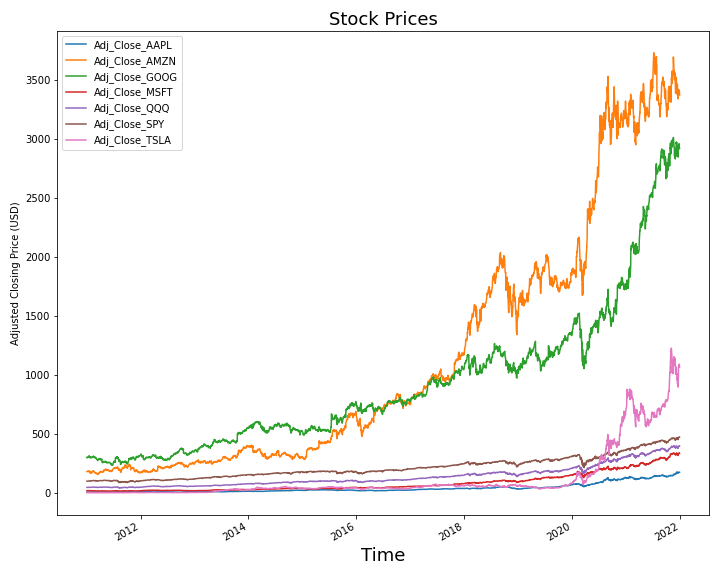
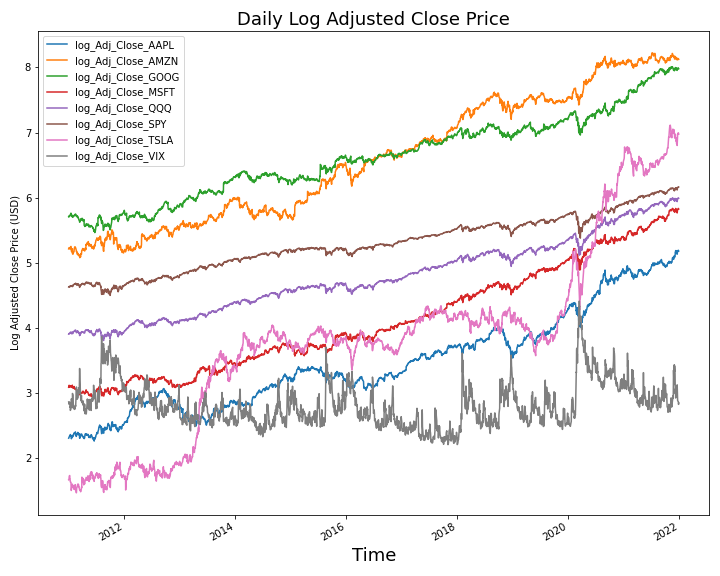
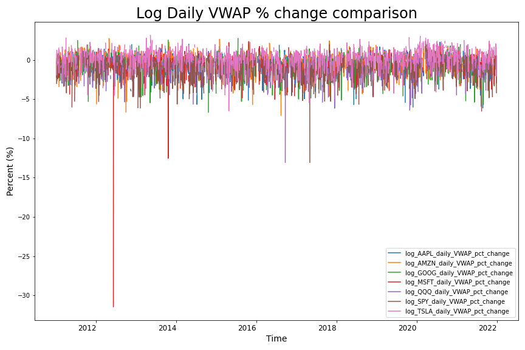
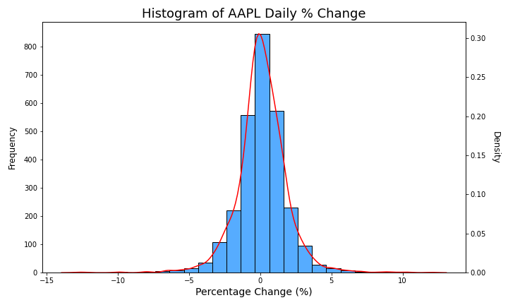
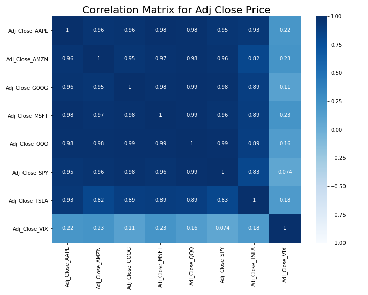
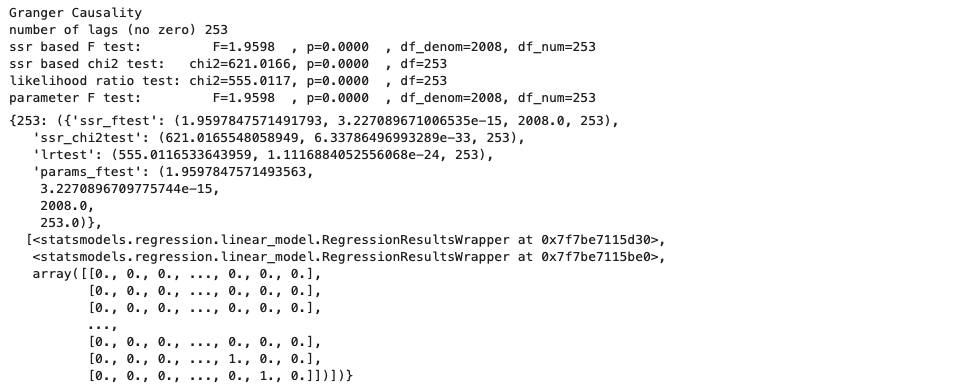
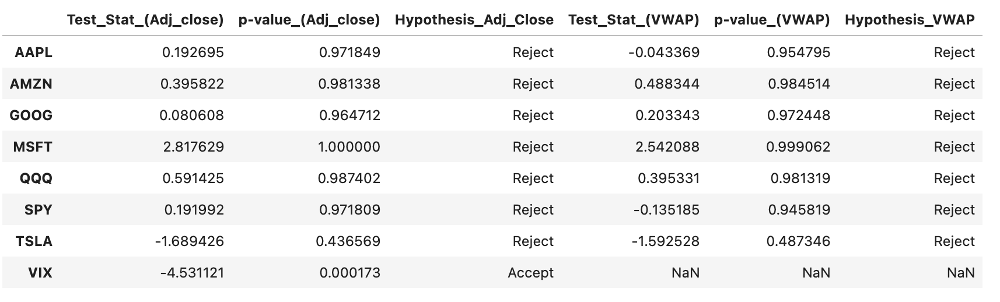
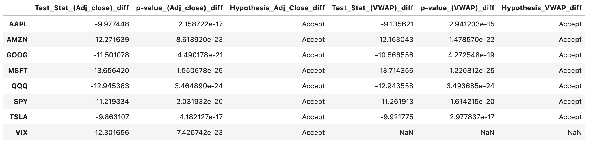

# Predicting the equity price with Time Series Analysis and Machine Learning. 

## Description
This is a capstone project for Data Science Immersive from General Assembly.<br><br>

In this project, historical trading data of selected equities is collected using Yahoo Finance API, Time Series Analysis and Machine Learning are performed to predict and forecast the future prices of selected equities. <br>
This project utilizes past 10 years of historical trading data from 2011 to 2021. The outcomes of machine learning and predictions reveal a general trend in the models utilized in the project not being able to pick up rather explosive recent growths in the stock market, yielding quite some diffrerence between the actual price of the equity and the predicted/forecasted price. The author hopes and intends to implement changes in the periods of trading data utilized for modeling and tune the models to navigate whether better prediction outcomes could be achieved. 

## Problem Statement

The goal in this project is to collect historical stock trading data using an API, perform Time Series Analysis and Machine Learning with Autoregressive Integrated Moving Average (ARIMA) model, Vector Autoregressive (VAR) model, and Long Short-Term Memory (LSTM) model to predict and forecast future stock price. The success of outcome will be measured based on how accurately the models predict equity price of the interest and compared to the actual prices of the equities.

## Libraries & Packages
In order to run this project properly, the following libraries and packages need to be installed:

|Library/Packages   | Command using `pip`|
|:---|:---|
||```pip install pandas```|
||```pip install numpy```|
||```pip install scikit-learn```|
||```pip install tensorflow```|
||```pip install keras```|
|Seaborn|```pip install seaborn```|
|Time|```pip install time```|
|Datetime|```pip install datetime```|
|Matplotlib|```pip install matplotlib```|
|Yahoo Finance API|```pip install yfinance```|
|Technical Analysis Library|```pip install ta```|
|Statsmodels|```pip install statsmodels```|
|pmdarima|```pip install pmdarima```|
|warnings|```pip install pytest-warnings```|

## Data Collection

Historical trading data of equities of interest was obtained using Yahoo Finance API. <br>
The data available from Yahoo Finance comprises of Open, High, Low, Close, Adjusted Close, and Volume of given equity. <br>
The API was set to collect daily trading data **from 01/01/2011 to 12/31/2021**, inclusive of all **trading days** in the past 10 years for pre-defined stock symbols: SPY, QQQ, AAPL, AMZN, GOOG, MSFT, TSLA, and VIX. <br>

Obtained data is saved to a CSV file to be accessed in a separate EDA notebook. The data collection notebook also introduces another way of obtaining the same data without using an API. 

All the code for data collection can be viewed here:

[Link to Data Collection Notebook](https://github.com/mh0805/Stock-price-prediction-and-forecast-with-Time-series-analysis-and-Machine-Learning/blob/main/1.%20Data_Collection.ipynb)

## Data Dictionary

|Term|Description|
|:-------|:-------|
|**Open**|Opening price of the equity for a given period|
|**High**|Highest price of the equity for a given period|
|**Low**|Lowest price of the equity for a given period|
|**Close**|Closing price of the equity for a given period|
|**Adj Close**|Adjusted closing price of the equity for a given period, accounting for any corporate actions, such as stock splits, dividents, and rights offerings. |
|**VWAP**|Volume-Weighted Average Price of the equity, calculated by taking the total dollar value of trading in the security and dividing it by the volume of trades for a given period.|
|**Daily_pct_change**|Daily percentage change of the equity, also referred often as daily returns. |
|**log_Adj_Close**|Log-transformed adjusted closing price of the equity for a given period, utilized to better compare the performance of the stocks. Log transformation reduces/removes the skewness of the original data.|
|**log_VWAP**|Log-transformed VWAP of the equity for a given period, utilized to better compare the performance of the stocks. Log transformation reduces/removes the skewness of the original data.|

## Exploratory Data Analysis
[Link to EDA Notebook](https://github.com/mh0805/Stock-price-prediction-and-forecast-with-Time-series-analysis-and-Machine-Learning/blob/main/2.%20EDA.ipynb)

The initial data from Yahoo Finance comprises of Open, High, Low, Close, Adj Close, and Volume. The data was clean without any missing values. Prior to begin with any EDA, the index was set to datatime index using pandas. Here is an example:
```python
SPY['Date'] = pd.to_datetime(SPY['Date'], format='%Y-%m-%d')
```
Once the indexes were reformatted, VWAP was calculated using technical analysis library `ta`. <br>

An attention was made here that **VIX** (Chicago Board Options Exchange (CBOE) Volatility Index) does not have any traded volume, hence is not considered in any future VWAP related calculations. 

Each equity was plotted with 50 and 200 moving average, then plotted together. <br>
Note: 50 and 200 daily moving averages are often referred to measure the performance of the stock and particularly for Golden Cross and Death Cross. [Read more about it here](https://www.investopedia.com/ask/answers/121114/what-difference-between-golden-cross-and-death-cross-pattern.asp)


Here, the chart is plotted with the actual dollar value of the stocks. While it is easy to compare the monetary value of each ticker's price per share value here, it would be better to compare the performances using log-scaled price charts.

Then, log adjusted prices of each equity were plotted to compare performance. 



Here, an observation was made that all stocks except the volatility index (VIX) made progressive growth over time, with particularly explosive growth noted in Tesla (TSLA) since late 2019 and onward. 

Daily trading volume and percentage changes were compared in the same fashion, as well as log-transformed data of each trading volume and percentage change as well. A similarity in the plots was observed, though it was difficult to locate an exact time period of the peaks in the plot due to the dataset being 10 years of **daily** trading data. From a log daily VWAP percentage change plot, an interesting phenomenon was observed. There were distinguishable **downward peaks**, suggesting that it would be worthwhile to investigate historical economical events preceeding the sudden spikes as a spin-off to this project.



Histograms and KDE plots were plotted for daily VWAP percentage changes and each histogram showed farely symmetrical distribution, showing both positive and negative daily returns. Here is an example:



It is also worthwhile to note that the equities chosen for this projects are some main leading companies in the market, holding heavy weights particularly in Standard and Poor 500 and Nasdaq. 

[Read more about S&P 500 holdings here](https://www.slickcharts.com/sp500) <br>
[Read more about Nasdaq holdings here](https://finance.yahoo.com/quote/NASDX/holdings/)

Hence, an attention was made to investigate the correlation between each equities. Correlation matrices were obtained for adjusted closing price, log adjusted closing price, daily percentage changes, and daily VWAP percentage changes of the stocks. As expected, they exhibited very high correlation. A score closer to 1 indicates high correlation and clower to 0 represents low correlation. Here is a correlation matrix for the adjusted closing price:



Note: VIX is a measure of market volatility. While not a direct inverse of market performance, **VIX tends to move in the opposite direction of the general market trend** as strong bull market is often less volatile compared to bear market. 

## Data Pre-processing & Modeling
[Link to Data pre-processing and Modeling Notebook](https://github.com/mh0805/Stock-price-prediction-and-forecast-with-Time-series-analysis-and-Machine-Learning/blob/main/3.%20Data%20Pre-processing%20%26%20Modeling.ipynb)

#### Data Pre-Processing

Prior to the modeling, a decision was made to drop feature-engineered columns and proceed with only adjusted closing price, volume, VWAP, and daily percentage change (return) of each stocks. Resulting data was cleaned to make sure there was no null values in the dataframe. 

Data was splitted 80:20 for train set and test set. Here, train set includes 8 years of trading data (2011-2019) and test set includes 2 years of trading data (2020-2021). 

Time-Series analysis of the data was performed prior to modeling. The following tests/plots were evaluated:
1. Granger-Causality Test: This test determines whether a time-series data is useful for forecasting another. Knowing the value of time series A at a certain lag is useful for predicting the value of time series B at a later time period. This test proides **F-test stat with a corresponding p-value**, which we can determinde wheter or not to reject the null hypothesis and conclude that we have sufficient evidence to say that the **time series A Granger-causes time series B**. 
There are an average of 253 trading days in a year. Here is an example:

```python
grangercausalitytests(df[['Adj_Close_SPY', 'Adj_Close_QQQ']], maxlag=[253])
```

**Summary**: Given the above results of Granger-Causality test, we can conclude that knowing the price of SPY is useful for predicting the future prices of stocks: AAPL, AMZN, GOOG, MSFT, QQQ, TSLA, VIX. This also goes in line with the correlation scores shown in the matrix earlier. While VIX showed low score in the correlation, it is due to VIX being the index of volatility and VIX tends to go opposite direction of the general market trend.

2. ACF & PACF Plots: Autocorrelation and Partial Autocorrelation plots. These plots provide valuable information to determine the order of Autoregressive (AR) and/or Moving Average(MA) componetns of ARMA model.<br> 
[Read more about ACF & PACF plots written by "Thought Partner for Data"](https://towardsdatascience.com/identifying-ar-and-ma-terms-using-acf-and-pacf-plots-in-time-series-forecasting-ccb9fd073db8#:~:text=The%20ACF%20and%20PACF%20plots%20indicate%20that%20an%20MA%20(1,shows%20a%20slowly%20decreasing%20trend.&text=5%20%26%206%20show%20ACF%20and,slow%20decay%20(gradual%20decrease).)

Here is an example. Lag was set to 365 t:
```python
plot_acf(df['Adj_Close_SPY'], lags=365), plot_pacf(df['Adj_Close_SPY'], lags=365)
```


**Summary**: Based on ACF & PACF plots in the above, adjusted closing prices of stocks AAPL, AMZN, GOOG, MSFT, QQQ, SPY, and TSLA are shown to be non-stationary.
VIX seems it needs more investigation into the data. Seasonal Decomposition and ADFuller test will follow.

3. Seasonal Decomposition: In time-series data, **seasonality** describes when a time series is affected by factors that take on a **fixed and known frequency**. Seasonality does not have to explicitly refer to seasons of the year, but it would mostly be tied to some meaning on the calendar. By default, the decomposition will **assume a linear trend**. If the trend is an exponential trend, then model should be multiplicative, but this will fail with values that are <= 0. <br>

4. Augmented Dickey-Fuller Test: ADFuller test is used to test for a unit root in a univariate process in the presence of serial correlation. It is a hypothesis test taht tests for **stationarity**. An assumption is made that the data are **not stationary**. With enough evidence, we may accept that the data are stationary. Test returns adf (test stat.), p-value, usedlag, nobs, critical values (dict), icbest, and resstore. <br> If test statistic (adf) < critical values (dict), we can reject the null hypothesis (not stationary) at that level of significance. Also, p-value is compared to $\alpha$ value of 0.05. If $p$-value > $\alpha$, we cannot accept that the given series is stationary, hence cannot reject the null hypothesis. 

5. Differencing Data for stationarity: The result from ADFuller test was observed that the time-series data was not stationary as shown below:


Hence, the data was differenced first-order and the null values were dropped.
```python 
df_for_diff = df_for_diff.diff().dropna()
```
Here is the result after differentiation:


Note: VIX does not have traded volume, hence there will be no VWAP related data for VIX. 

## Results and Next Steps

Talk about Results and Next Steps here


## Get to know the author

Hello 👋, my name is **Mason Lee**. <br>

I am recent Data Science Immersiave graduate from General Assembly. I am a passionate Data Scientist with background in Chemistry, Healthlcare, and Day-trading equities and derivatives. 

**BLAH BLAH BLAH PR STATEMENTS HERE... SELL MY STORY IN THIS SECTION!!**


<h4 align="left">Connect with me:</h4>
<p align="left">
<a href="https://linkedin.com/in/mason-lee85" target="blank"></a>
</p>

<h3 align="left">Languages and Tools:</h3>
<p align="left"> 
<a href="https://www.python.org" target="_blank" rel="noreferrer">  </a> 
<a href="https://scikit-learn.org/" target="_blank" rel="noreferrer">  </a> 
<a href="https://seaborn.pydata.org/" target="_blank" rel="noreferrer">  </a> 
<a href="https://www.tensorflow.org" target="_blank" rel="noreferrer"> </a> 
<a href="https://aws.amazon.com" target="_blank" rel="noreferrer">  </a>
<a href="https://git-scm.com/" target="_blank" rel="noreferrer">  </a>
<a href="https://pandas.pydata.org/" target="_blank" rel="noreferrer">  </a><a href="https://www.sqlite.org/" target="_blank" rel="noreferrer">  </a>     
</p>